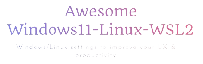

# Awesome-Windows11-WSL-Linux

The image you are looking at is a screenshot of a WSL Ubuntu terminal in Windows 11. The top bar is an app called GlazeWM.
You can follow this repository to get a similar setup on Windows11, Linux or both.

## Content of repository
- Linux (Ubuntu 22.04): [unix_workflow/README](unix_workflow/README.md).
  - can be used for Linux and WSL2.
- Windows 11 & WSL2: [windows_workflow/README](windows_workflow/README.md).
   - Valuable tips for enhancing your Windows user experience, with a focus on creating a productive environment incorporating WSL 2 (Linux).
   - Windows apps to enhance your productivity.
   - Includes a guide for installing WSL 2 and configuring it to work with Windows Terminal.
   - WSL setup & Linux guides & automated scripts [unix_workflow/README](unix_workflow/README.md) to automate the installation of essential components like terminal utilities, Conda, GPU drivers, and more.
   - No need for dual boot anymore, and includes SSH, SFTP with UI (Pycharm/FileZilla).
- Browser extensions: [windows_workflow/browser_extensions.md](windows_workflow/browser_extensions.md).

## Why this repository
#### Why Windows mixed with Linux (WSL)? Linux's users, please read till the end and don't be mad. 😅
**macOS:**
- (+) Excellent for coding and video editing. Supports Adobe & Office products.
- (-) Limited gaming capabilities compared to Windows & Linux.

**Linux:**
- (+) Ideal for coding and gaming, providing good performance in both areas.
- (-) Lacks support for Adobe & Office products and certain software.

**Windows with WSL:**
- (+) Seamless compatibility with diverse software, including Adobe & Office products.
- (+) Optimal choice for gaming enthusiasts.
- (+) Well-suited for coding with Windows Subsystem for Linux (WSL) and no need for dual boot.
- (-) UI is not smooth and responsive compared to macOS & Linux

Within the domain of development, Unix-based systems such as Linux and macOS frequently garner attention. Nevertheless, the integration of WSL allows smooth coding alongside the utilization of Adobe and Microsoft products that may lack support on Linux. This flexibility, coupled with the ability to handle resource-intensive games beyond macOS capabilities, positions Windows-WSL as an enticing platform, ensuring a well-rounded computing experience for all users, regardless of their workplace constraints.

Based on your needs, you can choose your OS.

## Awesome Piracy :
https://github.com/Igglybuff/awesome-piracy

## Star History (remember to star the repo 😁)

