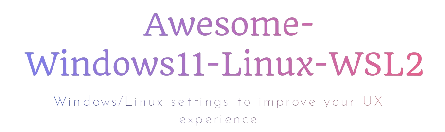

<div style="text-align: center;">The image you are looking at is a screenshot of a WSL Ubuntu terminal in Windows 11. The top bar is an app called GlazeWM.
You can follow this repository to get a similar setup on Windows11, Linux or both.


[](https://www.microsoft.com/en-in/windows)


</div>

**Table of contents**
<!-- TOC -->
  * [Linux/WSL2 (Ubuntu 22.04):](#linuxwsl2-ubuntu-2204)
  * [Windows 11 & WSL2:](#windows-11--wsl2)
  * [Browser extensions:](#browser-extensions)
  * [For Windows users: Why you should use WSL2?](#for-windows-users-why-you-should-use-wsl2)
  * [Star History (remember to star the repo 😁)](#star-history-remember-to-star-the-repo-)
<!-- TOC -->

## Linux/WSL2 (Ubuntu 22.04):
A set of configurations,
dotfiles and a script to automatically set up a powerful terminal & shell utilities(zsh, fzf...),
themes like Powerlvl10k, Conda, GPU drivers, and more on Linux/WSL2, again automatically.

Get started with one command :
```bash
sh -c "$(wget https://raw.githubusercontent.com/AmineDjeghri/Awesome-Windows11-WSL-Linux/master/unix_workflow/auto_linux_setup.sh -O -)"
```
Read more about it here: [unix_workflow/README](unix_workflow/README.md)

## Windows 11 & WSL2:
Valuable applications & tips for enhancing your Windows user experience, with a focus on creating a productive environment incorporating WSL 2 (Linux).

Read more about it here: [windows_workflow/README](windows_workflow/README.md)

## Browser extensions:
Read more about it here: [windows_workflow/browser_extensions.md](windows_workflow/browser_extensions.md).

## For Windows users: Why you should use WSL2?
WSL2 enables users to run Linux applications and utilize command-line tools natively on their Windows machines.
This integration allows users
to enjoy the familiarity of Windows while simultaneously harnessing the power and flexibility of Linux.

|              | macOS                                                                         | Linux                                                                      | Windows with WSL                                                                                                                                                                                                                        |
|--------------|-------------------------------------------------------------------------------|----------------------------------------------------------------------------|-----------------------------------------------------------------------------------------------------------------------------------------------------------------------------------------------------------------------------------------|
| Advantages   | (+) Excellent for coding and video editing. Supports Adobe & Office products. | (+) Ideal for coding and gaming, providing good performance in both areas. | - (+) Seamless compatibility with diverse software, including Adobe & Office products. <br> (+) Optimal choice for gaming enthusiasts <br> (+) Well-suited for coding with Windows Subsystem for Linux (WSL) and no need for dual boot. |
| Inconvenient | (-) Limited gaming capabilities compared to Windows & Linux.                  | (-) Lacks support for Adobe & Office products and certain software.        | (-) UI is not smooth and responsive compared to macOS & Linux                                                                                                                                                                           |

Within the domain of development, Unix-based systems such as Linux and macOS frequently garner attention. Nevertheless, the integration of WSL allows smooth coding alongside the utilization of Adobe and Microsoft products that may lack support on Linux. This flexibility, coupled with the ability to handle resource-intensive games beyond macOS capabilities, positions Windows-WSL as an enticing platform, ensuring a well-rounded computing experience for all users, regardless of their workplace constraints.

Based on your needs, you can choose your OS.

## Star History (remember to star the repo 😁)
[](https://star-history.com/#aminedjeghri/awesomewindows11&Date)
