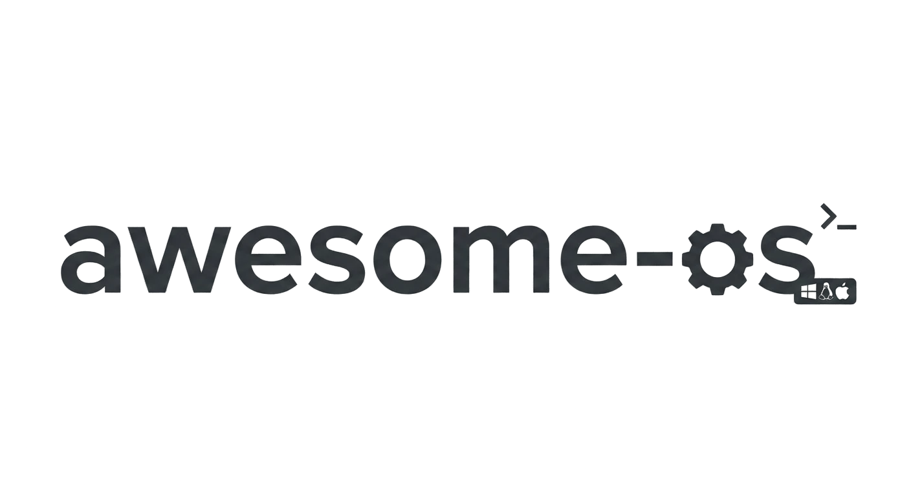
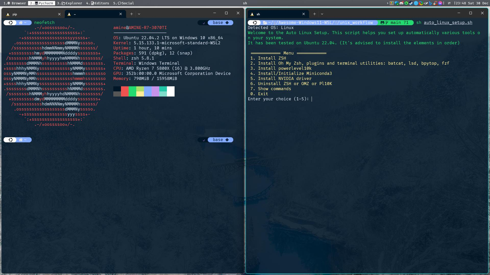

# Awesome OS Setup



| Windows WSL Terminal                                          | Desktop with terminals                                             |
|---------------------------------------------------------------|--------------------------------------------------------------------|
|  |  |

<div style="text-align: center;">The image you are looking at is a screenshot of a WSL Ubuntu terminal in Windows 11. The top bar is an app called GlazeWM that is a tiling WM that lets you organize windows and adjust their layout on the fly by using keyboard-driven commands.
You can follow this repository to get a similar setup on Windows11, Linux or both.


[](https://www.microsoft.com/en-in/windows)


</div>

**Table of contents**
<!-- TOC -->
* [Awesome OS Setup](#awesome-os-setup)
  * [Get started](#get-started)
    * [Linux / WSL2 / MacOS](#linux--wsl2--macos)
    * [Windows 11](#windows-11)
  * [What is this repo?](#what-is-this-repo)
    * [Features & Benefits](#features--benefits)
    * [Docs and websites](#docs-and-websites)
  * [Project TODO / Roadmap](#project-todo--roadmap)
    * [Docs & site](#docs--site)
    * [Quality & UX](#quality--ux)
  * [Check the documentation](#check-the-documentation)
  * [Contributing (For developers)](#contributing-for-developers)
<!-- TOC -->


### Get started

#### Linux / WSL2 / MacOS
Get started with one command in bash/zsh:

```bash
sh -c "$(wget https://raw.githubusercontent.com/AmineDjeghri/awesome-os-setup/v2/install_unix.sh -O -)"
```

#### Windows 11
Get started with one command (run it in PowerShell as administrator):
```powershell
iex ((New-Object System.Net.WebClient).DownloadString('https://raw.githubusercontent.com/AmineDjeghri/awesome-os-setup/v2/install_windows.ps1'))
```

## What is this repo?

This repo is a personal “OS setup Terminal UI App”:


### Features & Benefits

- **One‑liner installers**
  - Windows: PowerShell script that installs selected apps via `winget`, enables WSL, applies Windows Terminal defaults, and fetches GlazeWM config.
  - Linux / WSL/ macOS: Bash script that installs Zsh/OMZ/P10k, terminal tools, and optional NVIDIA for Linux.

- **Cross‑OS Python TUI**
  - TermTk‑based app (`main.py`) with:
    - OS detection (Windows, WSL, Linux, macOS),
    - System action sections (WSL tools, Windows utilities, package managers).

- **Unified package catalog**
  - `src/awesome_os/config/packages.yaml` as a single source of truth for packages.
  - Concrete backends implemented:
    - Linux:
      - Ubuntu: `UbuntuAptManager`, `UbuntuSnapManager`,
      - Arch: `ArchLinuxYayManager`
    - Windows: `WindowsWingetManager`,
    - macOS: `DarwinBrewManager`, `DarwinBrewCaskManager`.

- **WSL workflow helpers**
  - Actions to:
    - List installed / online distros,
    - Install a distro with optional custom location,
    - Export / import / move / unregister distros,
    - Shutdown and update WSL.

- **Windows Terminal helpers**
  - Apply consistent defaults (Night Owl scheme, JetBrains Mono font, opacity, elevation).
  - Add a dedicated **Ubuntu profile** with an icon.

- **Curated documentation**
  - Windows & Linux workflows, TV setup, app shortcuts, and browser extensions, mirrored to a static site via `mkdocs`.


### Docs and websites

- **Windows/WSL2 docs**:
  here: [windows_workflow_README.](docs/windows_workflow/README.md) / [Website](https://setup.aminedjeghri.com/readme-windows.html)

- **Linux/WSL2 docs**:
  here: [README](docs/linux/README.md) / [website](https://setup.aminedjeghri.com/readme-unix.html)

- **macOS docs**:
  here: [README](docs/macos_darwin/README.md) / [website](https://setup.aminedjeghri.com/readme-macos.html)

- **TV setup docs**: Read me about it
  here: [README](docs/android-tv/readme.md) / [website](https://setup.aminedjeghri.com/tv_setup.html)

- **Apps setup docs**:
  [README](docs/apps/apps_configuration_and_shorcuts.md) / [website](https://setup.aminedjeghri.com/shortcuts_and_apps_setup.html)

- **Websites & Browser extensions docs**:
  [README](docs/apps/awesome_websites_browser_extensions.md) / [website](https://setup.aminedjeghri.com/awesome-websites.html)

**For Windows users: Why you should use WSL2?**
WSL2 enables users to run Linux applications and use command-line tools natively on their Windows machines.
This integration allows users
to enjoy the familiarity of Windows while simultaneously harnessing the power and flexibility of Linux.
Also, a surprising number of Linux GUI apps can run on WSL. GUI applications are officially supported on WSL2 and
referred to as [WSLg](https://github.com/microsoft/wslg)(No installation required).

|              | macOS                                                                         | Linux                                                                      | Windows with WSL                                                                                                                                                                                                                          |
|--------------|-------------------------------------------------------------------------------|----------------------------------------------------------------------------|-------------------------------------------------------------------------------------------------------------------------------------------------------------------------------------------------------------------------------------------|
| Advantages   | (+) Excellent for coding and video editing. Supports Adobe & Office products. | (+) Ideal for coding and gaming, providing good performance in both areas. | - (+) Seamless compatibility with diverse software, including Adobe & Office products. </br> (+) Optimal choice for gaming enthusiasts </br> (+) Well-suited for coding with Windows Subsystem for Linux (WSL) and no need for dual boot. |
| Inconvenient | (-) Limited gaming capabilities compared to Windows & Linux.                  | (-) Lacks support for Adobe & Office products and certain software.        | (-) UI is not smooth and responsive compared to macOS & Linux                                                                                                                                                                             |

Within the domain of development, Unix-based systems such as Linux and macOS frequently garner attention. Nevertheless,
the integration of WSL allows smooth coding alongside the utilization of Adobe and Microsoft products that may lack
support on Linux. This flexibility, coupled with the ability to handle resource-intensive games beyond macOS
capabilities, positions Windows-WSL as an enticing platform, ensuring a well-rounded computing experience for all users,
regardless of their workplace constraints.

Based on your needs, you can choose your OS.

## Project TODO / Roadmap

- [ ] Some dotfiles integration (GlazeWM, aerospace, raycast...)
- [ ] Chezmoi integration

### Docs & site

- [ ] Fix broken README one‑liners (curl/wget URLs to this repo) and update URL to main branch
- [ ] Update `mkdocs.yml`:

### Quality & UX

- [ ] Update UX/UI.
  - [ ] Display a checkmark when a package is installed.
- [ ] Add tests and CI coverage for:
  - [ ] Parsing `packages.yaml`.
  - [ ] Package manager factory mapping.
  - [ ] Windows/WSL command runner behavior.
  - [x] Docker image to test Arch
  - [ ] Docker image to test Ubuntu
  - [ ] Docker image to test macOS


## Check the documentation
You can check the documentation (website).

## Contributing (For developers)
Check the [CONTRIBUTING.md](CONTRIBUTING.md) file for more information.

**Star History Chart**
[](https://star-history.com/#aminedjeghri/awesomewindows11&Date)
