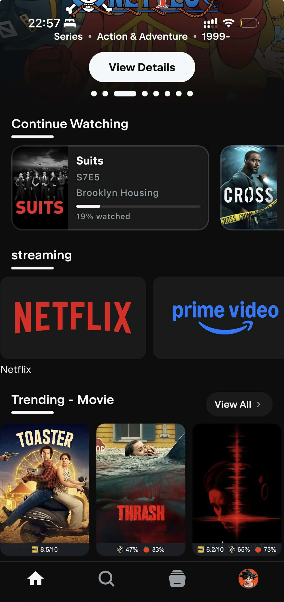
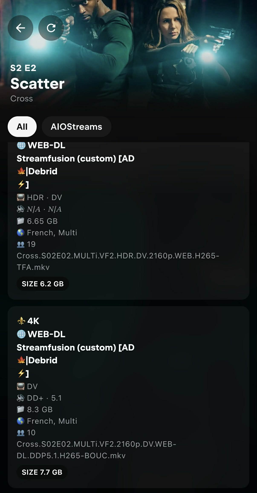

# TV Setup (googletv / android tv)
One of the best TV OS is Google TV. Here are some reasons why you should consider using Google TV:
- Sideloading apps is straightforward on Google TV. You can install apps like Stremio, SmartTube, and others.
- It's not as responsive as Apple TV, but you can tweak it to make it faster.
- You can use alternative launchers like 'Projectivy'.

**Table of contents**
<!-- TOC -->
* [TV Setup (googletv / android tv)](#tv-setup-googletv--android-tv)
  * [All TV types:](#all-tv-types)
  * [Google TV OS:](#google-tv-os)
    * [Best google TV apps:](#best-google-tv-apps)
      * [What is Stremio / Nuvio ?](#what-is-stremio--nuvio-)
      * [Installation](#installation)
      * [🌐 AIOStreams + Nuvio Configuration Guide](#-aiostreams--nuvio-configuration-guide)
        * [🧩 What is AIOStreams?](#-what-is-aiostreams)
        * [🪪 Step 1 — Login to NuvioTV or NuvioMobile](#-step-1--login-to-nuviotv-or-nuviomobile)
        * [⚙️ Step 2 — Open AIOStreams](#-step-2--open-aiostreams)
        * [🧱 Step 3 — Create Your Configuration](#-step-3--create-your-configuration)
        * [📂 Step 4 — Import Your Settings](#-step-4--import-your-settings)
        * [🔑 Step 5 — Enable Your Debrid Services, TMDB API and Posters](#-step-5--enable-your-debrid-services-tmdb-api-and-posters)
        * [(Optional) Step 6 — Configure Optional Addons (Disabled by Default)](#optional-step-6--configure-optional-addons-disabled-by-default)
          * [⚙️ (optional) Configure *Baguettio (custom)* for French content:](#-optional-configure-baguettio-custom-for-french-content)
          * [⚙️ (optional) Configure *Streamfusion (custom) for French content*:](#-optional-configure-streamfusion-custom-for-french-content)
          * [⚙️ (optional) Configure *Statusio (custom)*:](#-optional-configure-statusio-custom)
          * [⚙️ (optional) Configure *Top-Streaming (custom)* for US catalogs:](#-optional-configure-top-streaming-custom-for-us-catalogs)
          * [⚙️ (optional) Configure *Top-streaming FR (custom)* for French catalogs:](#-optional-configure-top-streaming-fr-custom-for-french-catalogs)
          * [⚙️ (optional) Configure *TVMio* for Live TV:](#-optional-configure-tvmio-for-live-tv)
          * [⚙️ (optional) Configure *AI Search (custom)*:](#-optional-configure-ai-search-custom)
        * [💾 Step 7 — Save and Install](#-step-7--save-and-install)
        * [✅ Step 8 — Test Everything](#-step-8--test-everything)
        * [💡 Nuvio/Stremio Tips](#-nuviostremio-tips)
      * [Collections](#collections)
      * [Useful Stremio/Nuvio Resources](#useful-stremionuvio-resources)
<!-- TOC -->

## All TV types:
- My first advice is to never use the standard mode on your TV. Always use the cinema/ filmaker or movie mode. The
  standard mode is too bright and the colors are not accurate. Use the cinema or movie mode when watching movies or
  series.
- Here is a [video](https://www.youtube.com/watch?v=dY3M_h30HYc) explaining TV modes.
  And [this video](https://www.youtube.com/watch?v=nTO2Wmw1NKA) for changing the settings of your TV taking into
  account different modes (SDR, HDR, Dolby). (You can refer to reddit guides or YouTube videos
  or [rtings.com](https://rtings.com) to find the best settings).
- If your TV supports multiple content types (SDR, HDR, DOLBY), the mode needs to be activated on each content type.
- On some TVs like the Hisense U7k, you need to enable enhanced HDMI mode to access dolby vision & 60HZ on your
  Chromecast and other HDMI inputs.
- If you play video games, use the game mode. It will reduce the input lag and improve the gaming experience.

## Google TV OS:
- (Important) Enhance the performance of your Google TV by following
  this [tutorial](https://www.slashgear.com/1321192/tricks-make-chromecast-google-tv-run-faster/)
- Chromecast google TV
  4k [video settings](https://www.reddit.com/r/Chromecast/comments/1ct77ai/a_fix_for_washed_out_colors_and_performance/)
- Chromecast google TV remote: you can use your iPhone or android to remotely control google tv and use your
  phone's keyboard, for example. You need either Google TV app or Goohle home app on you phone. on your google
  TV, the feature is disabled by default: you need to go to system-> keyboard -> manage keyboards -> check
  virtual remote. You can now use your phone to type things rapidely
- Windows 11 with 4K HDR TV: follow this [tutorial 1](https://www.pcmag.com/how-to/set-up-gaming-pc-on-4k-tv)
  and [tutorial 2](https://www.pcmag.com/how-to/how-to-play-games-watch-videos-in-hdr-on-windows-10)
- recommended TV apps for Google TV: Projectivy launcher, Stremio, Nuvio, Smart Tube, YouTube atv. update the channels in
the Projectivy and add Stremio and Nuvio there. Also make it the default launcher for your tv.

### Best google TV apps:
- [SmartTube](https://smartyoutubetv.github.io/): A free Android TV app alternative to YouTube with no ads, designed for TV screens, up to 8K video resolution, supports youtube accounts.
- [Projectivy Launcher](https://play.google.com/store/apps/details?id=com.spocky.projengmenu&hl=en&pli=1):  an alternative app launcher for Android TV devices that provides users with a different home screen and method for navigation and opening apps.
    -  Remember to export your settings: https://www.reddit.com/r/Projectivy_Launcher/comments/1cdt00f/tell_me_about_exporting_these_launcher_settings/
    -  You can create channels in the menu and add stremio, smartube, spotify to the home screen.
- [Stremio](https://www.stremio.com/) / [Nuvio](https://nuvioapp.space/)

#### What is Stremio / Nuvio ?

- Stremio/Nuvio are video streaming applications that allows you to watch and organize video content from different services,
  including movies, series, live TV and video channels. The content is aggregated by an addon system providing streams
  from various sources. And with its commitment to security, Stremio/Nuvio are the ultimate choice for a worry-free,
  high-quality streaming experience.

- Stremio is available on all platforms: Web, Windows, Mac, Linux, Android, iOS, Android TV, Apple TV...
- For 2026, I recommend using Nuvio. Nuvio is recent, full open source and has a lot of features directly integrated in the app. It is compatible with Stremio Addons. It is available on: Android, iOS, Android TV
- Addons...etc will be synchronized between all your devices.
- You will use a debrid service (like Real Debrid, All Debrid), so you won't need any VPN.
  What is a debrid service? A debrid service is an unrestricted multi-hoster that allows you to stream and download videos instantly at the best speeds. In plain English, the debrid services act as a proxy between the BitTorrent tracker and you, so you download the content directly from their servers at high speed. Most of the content is already cached, meaning you can instantly access it. Personnaly, I use ALL Debrid, but others exist like : TorBox, Real Debrid...

#### Installation
- (Updated April 2026) : This guide applies to Nuvio, but it is also valid for Stremio.
- First of all, you can do everything with your mobile. It's just better if you have a computer, but it's not necessary.
- If you never used Stremio, I advise you to start with this [fast tutorial](https://arnav.au/2025/04/16/stremio-torrentio-debrid-how-to-guide/)
- If you want to understand everything, there is [a complete and detailed tutorial](https://guides.viren070.me/stremio/).
- If you know how to use Stremio, the same steps apply to Nuvio.
- Setup :
    - Log in with your regular account into Stremio or Nuvio.
    - Subscribe to AllDebrid (or Real Debrid or Torbox). For All Debrid : https://alldebrid.com/ , do not select the free trial, it doesn't work.
    - Configure this addon for example: CometFR addon https://comet.stremiofr.com/ , Add in 'Debrid Service' AllDebrid and put your api key. UNCHECK the 'Enable torrents'
    - Go back to Stremio/Nuvio -> Addons, install addon -> and copy the manifest URL.
    - Select a movie, you should see the streams (the results to watch a movie). IF not, go to AllDebrid and accept the IP address request.

🚨 IMPORTANT
Since addons are hosted in different servers, everytime you add a new addon, you need to go to AllDebrid and validate the IP Address.

- After making any change to any addon, you don't need to close the application to synchronize the changes, just click on the addons tab, and go back to home.
- My recommended Setup: Install these addons.
- AIOStreams:

#### 🌐 AIOStreams + Nuvio Configuration Guide

##### 🧩 What is AIOStreams?

AIOStreams is an all-in-one **Stremio addon manager** that lets you organize, install, and sync all your favorite addons in one place.

It also allows you to **save your configuration online**, so you don’t lose your setup.

Your data is linked to a **UUID** (your unique ID) and a **password**, so you can restore your configuration anytime.

---

##### 🪪 Step 1 — Login to NuvioTV or NuvioMobile
Log in with your regular  account.

---

##### ⚙️ Step 2 — Open AIOStreams
Visit 👉  [https://aiostreamsfortheweebs.midnightignite.me/](https://aiostreamsfortheweebs.midnightignite.me/)
Your can also use the [AIOStreams (ElfHosted)](https://aiostreams.elfhosted.com/) but it is limited to 10 addons and there is no Torrentio support.

This page is where you manage everything related to your addons.

---

##### 🧱 Step 3 — Create Your Configuration
1. Go to the **“Save and Install”** section.
2. Enter a **password** of your choice — this will create your AIOStreams account.
3. You’ll receive a **UUID** (like your username).
4. **Save both the UUID and your password!** You’ll need them to restore or import your configuration later.

---

##### 📂 Step 4 — Import Your Settings
1. Download [my configuration file](../../src/awesome_os/config/others/aiostreams-config.json)
2. Go to **“Navigate and Install”**.
3. Click **Import**.
4. Select and upload your saved configuration file. You will an error message saying that some Keys are missing which is normal for now.

Your addons and settings will load automatically.

---

##### 🔑 Step 5 — Enable Your Debrid Services, TMDB API and Posters
1. In AIOStreams, go to **Services**.
2. Enable your preferred **Debrid service** (e.g.,AllDebrid, Real-Debrid, TorBox).  I am using All Debrid, if you choose another Debrid provider, you will need to edit the provider in each addon (which is very easy since it's just a select box)
3. Enter your API key.
4. Scroll down or check in the tabs to find the `Metadata` section, and look for 'TMDB' and follow the instructions to add your TMDB API keys.
5. Scroll down or check in the tabs to find the `Posters` section, select RPDB and enter the following api key : `t0-free-rpdb`. Check the options : 'Use Poster Service for Library/Continue Watching' and 'Redirect API'

---

##### (Optional) Step 6 — Configure Optional Addons (Disabled by Default)
The following addons are disabled by default in the configuration. Enable them only if you need their specific features:

###### ⚙️ (optional) Configure *Baguettio (custom)* for French content:
1. Baguettio is a French addon with additional French streaming sources
2. Configure at https://baguettio.org
3. Copy the manifest URL and paste it in AIOStreams
4. Enable for enhanced French content availability

###### ⚙️ (optional) Configure *Streamfusion (custom) for French content*:
1. Streamfusion provides additional French streaming sources
2. Click the **Edit** button in AIOStreams
3. Look for StreamFusion API Key and follow the instructions to get the api key from the telegram bot
4. Copy the key and enable the addon

###### ⚙️ (optional) Configure *Statusio (custom)*:
1. Statusio helps monitor your debrid service status.
2. Go to https://statusio.elfhosted.com/configure to set it up
3. Copy the manifest URL and paste it in AIOStreams under 'Statusio (custom)'
4. Enable the addon if you want status monitoring

###### ⚙️ (optional) Configure *Top-Streaming (custom)* for US catalogs:
1. Go to https://top-streaming.stream/configure?lang=en
2. Select 'Standard Posters' for poster type
3. Copy the manifest URL and paste it in AIOStreams
4. Enable to get Netflix, Amazon Prime, HBO Max, Disney+ top 10 lists for US

###### ⚙️ (optional) Configure *Top-streaming FR (custom)* for French catalogs:
1. Go to https://top-streaming.stream/configure?lang=fr
2. Select 'Standard Posters' for poster type
3. Copy the manifest URL and paste it in AIOStreams under 'Top-streaming FR (custom)'
4. Enable to get French streaming service catalogs (Canal+, Netflix FR, etc.)

###### ⚙️ (optional) Configure *TVMio* for Live TV:
1. TVMio provides live TV channels for France, Argentina, and Spain
2. Go to https://tvmio.ooguy.com to configure
3. Copy the manifest URL and paste it in AIOStreams
4. Enable if you want live TV support

###### ⚙️ (optional) Configure *AI Search (custom)*:
1. AI Search provides intelligent recommendations based on your viewing history
2. Go to https://stremio.itcon.au/ to configure
3. It is preferable to use this addon with Trakt for better recommendations
4. Follow the tutorial on their website to get the api keys
5. Copy the manifest URL and paste it in AIOStreams
6. Enable for AI-powered search and recommendations
---

##### 💾 Step 7 — Save and Install
1. Go back to the **Install** section.
2. Click **Save** — this saves your configuration to your online AIOStreams account.If you see a timeout error with the name of an addon, it means that this addon is down right now. Just deactivate it and save again (sometimes StremFusion and Opensubtitles V3+ are down)
3. Then click **Install** and copy the link to Nuvio/Stremio addons. [Nuvio Web](https://nuvioapp.space/account?tab=addons) for example.

---

##### ✅ Step 8 — Test Everything
Open any movie or TV show in Nuvio/Stremio.
You should now see your addons providing streams.
After selecting a movie, you should see this (Statutios appears only if you installed it):

As you can see, the streams display clean, readable, and emoji-enhanced stream information inside Stremio. But what does these emojis mean ?

- 🎞️ Resolution Badges (From top to worse): ⚜️ 4K for 2160p, 📀 1440p, 📀 1080p ...etc ⚪ N/A if resolution is missing

- 🏷️ Quality Labels (From top to worse): 📀 REMUX, 💿 Blu-ray, 🌐 WEB-DL, 🖥️ WEBRip, 💾 HDRip / DVDRip / HDTV / TS / TC, ⚪ N/A if no quality tag exists

- Cached streams: [AD⚡️]: The lightning symbol means the stream is cached, ⏳️ means not cached. It's preferable to select a cached stream because a non-cached stream means that you the debrid service will try to download it, and if there isn't any seeders, you won't be able to stream it.

- If every stream appears with the ⏳ (not cached) icon and none show the ⚡️ (cached) indicator, it usually means your IP address has not been validated on your AllDebrid account.
Some debrid services (including AllDebrid) require you to confirm your current IP before they allow cached torrents to be accessed.
So when you start a stream for the first time from a new addon, the service blocks cached access until the IP is verified.

To fix this:

- Start any stream in Stremio (this triggers the request on the debrid side).

- Go to your debrid service’s website (e.g., AllDebrid).

- You should see a prompt asking you to validate or authorize your IP address. Confirm it — and cached streams will immediately switch from ⏳ to ⚡️.
- Keep your **UUID** and **password** safe — that’s your AIOStreams login.
- You can restore your setup anytime by re-entering your credentials.
- AIOStreams makes it easy to sync and manage all your addons from one place.

##### 💡 Nuvio/Stremio Tips
- In Stremio/Nuvio Settings, you can select the preferred 'Audio language' and 'Subtitles'. This will automatically set the audio and subs automatically when you watch something. This is not synced between devices, you need to do it manually on each of your device.
- ALl settings & addons will sync between your devices if you use the same account.

- (Optional) Trakt :
    - Trakt is a media tracking service that helps users sync their TV shows and movies across numerous platforms and devices.
    - You can enable trakt in Nuvio/Stremio settings. You can download Trakt mobile app or use their website.
    - For me, cinemeta addon was required to properly sync trakt with Nuvio/Stremio.
    - Ratings & history: I rank my movies (and series) on trakt (they will automatically mark as watched if you
     activate that setting in Trakt's website : settings -> Mark Watched After Rating: Automatically mark unwatched
     items with today's date).
    - If you didn't rate some movies & tv shows, you can add them to history in Trakt to avoid being recommended by the 'AI Search' addon.
    - If you want to synchronize Trakt with IMDB you can use [IMDB-Trakt-Syncer](https://github.com/RileyXX/IMDB-Trakt-Syncer). You can rate what you watch on IMDB or trakt and run the python app to sync everything.
    - You can also import Netflix and Amazon Prime Video watch history to Trakt using this free opensource Chrome/Firefox extension : https://github.com/trakt-tools/universal-trakt-scrobbler
#### Collections

Collections allow you to organize your content into custom categories (Netflix, Apple TV, etc.) without needing additional addons.

1. For detailed setup instructions, follow [this community tutorial](https://www.reddit.com/r/Nuvio/s/7bTcL9OcmZ) starting at 2:35
2. Go to [Nuvio Collections Manager](https://nuvioapp.space/account?tab=collections) (or use the mobile app, which is easier)
3. Create your custom collections with names like "Netflix", "Apple TV", "My Watchlist", etc and add catalogs and images

You can customize how your collections look by adding cover images and configuring display settings:

**Cover Images (Logos)**:
- Find collection cover images here: [Netflix, Apple, and other logos](https://postimg.cc/gallery/y7V9gYX)
- Example: [Netflix logo](https://i.postimg.cc/WVXFgmRn/Netflix.png)
- **Important**: Make sure the URL includes the file extension (e.g., `.png`)
- Find genre images here: [Genre artwork gallery](https://postimg.cc/gallery/LhYL0YQ/)

**Display Settings**:
- **Tile Shape**: Set to "Landscape" for wider tiles
- **Show GIF When Configured**: Set to "False" to use static images
- **Hide Title**: Set to "True" to show only the cover image without text

After configuring these settings, add your collections to your home screen for easy access.

#### Useful Stremio/Nuvio Resources

- **Subreddits**: [r/Stremio](https://www.reddit.com/r/Stremio/) & [r/StremioAddons](https://www.reddit.com/r/StremioAddons/)
- **Addons Catalog**: [stremio-addons.net](https://stremio-addons.net/)
- **French Community**:
    - [stremiofr.me](https://stremiofr.me/)
    - [r/Stremio_France](https://www.reddit.com/r/Stremio_France/)
    - [Discord Server](https://discord.gg/KN3vRqTHDa)
