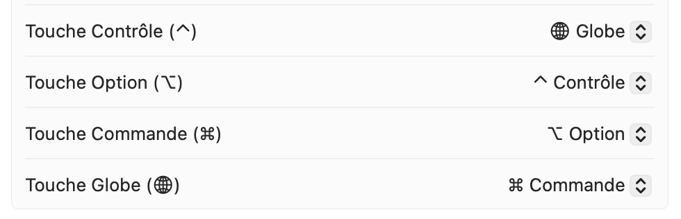

# macOS (Darwin) setup

This document describes how to get a productive macOS setup (terminal + apps + UX tweaks) consistent with the rest of this repo.


## Windows/Linux behavior mimicking in macOS

If you're coming from Windows or Linux, macOS has some different behaviors. You can remap keys to make the layout feel closer to Windows. This is useful if you frequently switch between macOS and Windows/Linux, as it reduces muscle memory conflicts and makes your workflow more consistent across platforms.

Here are useful tweaks to make it feel more familiar:
- **Invert mouse scrolling**: By default, macOS uses "natural" scrolling (like on iOS). To get Windows-like scrolling behavior, go to **System Settings > Mouse** and invert the scrolling.
- **Keyboard layout**: Change macOS shortcuts to behave like Linux/Windows (This is useful if you want to use the same keyboard layout to copy-paste on all your devices)
  

Keep the mapping consistent and avoid mixing multiple remap tools.

After doing this, when you see some tutorials using macOS keyboard shortcuts, remember that you changed the keyboard layout.
- **Command (⌘)** is the macOS equivalent of **Ctrl** and handles most system shortcuts (copy, paste, save, etc.). After remapping, the **Globe key** (leftmost modifier key) becomes your Command key, functioning exactly like the **Ctrl** key on Windows/Linux keyboards.

- **Option (⌥)** is similar to **Alt** on Windows and is used for special characters and alternative shortcuts. After remapping, the **Option key** (rightmost modifier key) becomes your secondary modifier, equivalent to **Alt** on Windows/Linux.

- **Control (⌃)** is typically used for secondary actions like interrupting commands in the terminal (Ctrl+C). After remapping, the **Option key** replaces Control for these terminal operations, so you'll use **Option+C** to cancel instead of **Ctrl+C**.

- **Globe key** (the dedicated key on the far left) which is used for emojis and switch between languages has been remapped to function as **Control (⌃)**, providing the traditional Control key functionality when needed.

- **Delete** behaves like Backspace on Windows. To delete characters forward (like Delete on Windows), use **Fn + Delete**.

After remapping our keys, to copy-paste, it will be the same as in Windows/Linux keyboard:
- **Globe** + **C** to copy
- **Globe** + **V** to paste


## Installation Process

The Personal OS Setup provides a **Terminal UI (TUI) application** that guides you through the installation process. Once you run the one-liner installer, you'll see an interactive interface with the following steps:

Use [README.md](../../README.md#linux--wsl2--macos) as it automatically handles the OS setup with the interactive TUI application.


### 1. Package Selection
The app displays all available packages from [packages.yaml](../../src/personal_os_setup/config/packages.yaml) organized by category:
- **Core tools**: `git`, `curl`, `zsh`
- **Dev tools**: `uv`, `Pycharm`, `Ghostty`, `Zed`, `Docker-Desktop`
- **Utilities**: `Raycast`, `Alt-Tab`, `AeroSpace`, `Shottr`
- **Messaging**: `Discord`, `WhatsApp`, `Telegram`
- **Media**: `Stremio`, `VLC`

You can multi-select packages using the interactive interface.


### 2. Terminal Setup (Zsh + Oh My Zsh + Powerlevel10k)
This section is the same as Linux. Follow the terminal ZSH instructions in [Linux](../linux/README.md#2-terminal-setup-zsh--oh-my-zsh--powerlevel10k).

## 3. Recommended apps

This repo’s [packages.yaml](../../src/personal_os_setup/config/packages.yaml) includes my macOS `brew` packages and `cask` recommended apps.

Here is some config files for some apps:
### 3.1. Raycast

- Use Raycast as a “PowerShell equivalent” launcher.
- Replace Spotlight:
  - Remove Spotlight shortcut in macOS keyboard settings.
  - Configure the same shortcut for Raycast.
- Finder is still useful for macOS-specific settings and edge cases.

### 3.2. AeroSpace + JankyBorders

- AeroSpace: tiling window manager.
  - Tutorial: https://www.youtube.com/watch?v=-FoWClVHG5g
  - Docs: https://nikitabobko.github.io/AeroSpace/
- JankyBorders: adds window borders (requires AeroSpace).
- My config : [.aerospace.toml](../../src/personal_os_setup/config/darwin/.aerospace.toml)


## 4. UI/UX tweaks

- Enable sudo with Touch ID:

```sh
sed -e 's/^#auth/auth/' /etc/pam.d/sudo_local.template | sudo tee /etc/pam.d/sudo_local
```
- Night Shift.
- Auto-hide the dock.
- Remove unused menu bar icons:
  - Hold `command` then drag the icon out of the menu bar (not all apps support it).
- Finder:
  - Show tab bar.
  - Show path bar: View → Show Path Bar (or `Option + Command + P`). The path bar at the bottom of the Finder window shows the full path to the current folder and lets you click any part of it to navigate directly there.
  - Show hidden files: `command + shift + .`


## 5. Notes

- Some apps do not have import/export settings and require manual configuration (e.g. Ice, AltTab).
- Some apps might need manual installation (e.g. Badgeify).
