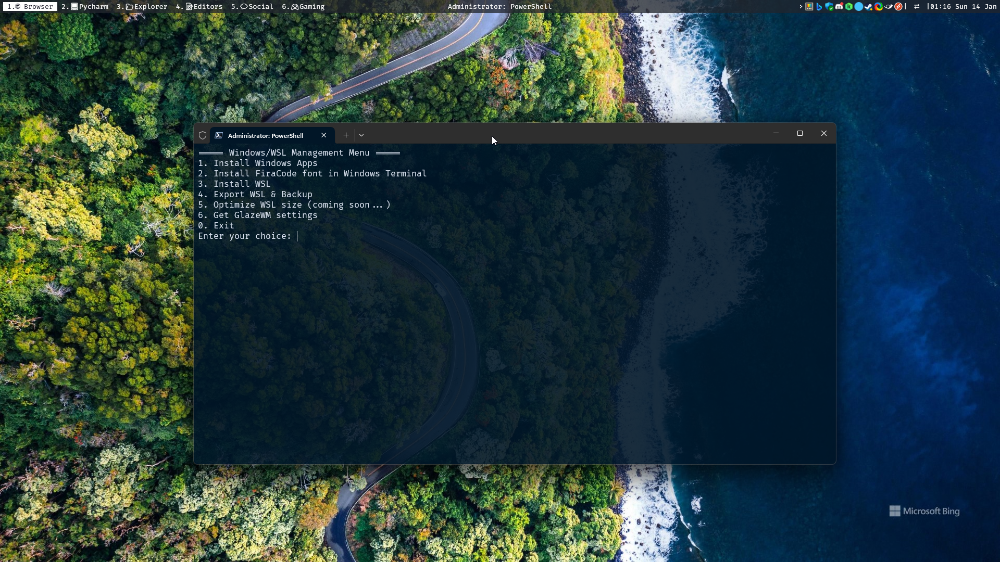

# Windows & WSL setup




The image you are looking at is a screenshot of a WSL Ubuntu terminal in Windows 11. The top bar is an app called GlazeWM.
You can follow this repository to get a similar setup.

**Table of Contents**
<!-- TOC -->
* [Windows & WSL setup](#windows--wsl-setup)
  * [1. Windows account & configuration](#1-windows-account--configuration)
    * [1.1. Windows account](#11-windows-account)
    * [1.2. Windows configuration](#12-windows-configuration)
  * [2. Software](#2-software)
    * [2.1. Mainstream Software](#21-mainstream-software)
    * [2.2. UI/UX Software](#22-uiux-software)
    * [2.3. Dev Software & Websites](#23-dev-software--websites)
      * [2.3.1. PyCharm:](#231-pycharm)
      * [2.3.2. Windows Terminal](#232-windows-terminal)
      * [2.3.3. Docker Desktop](#233-docker-desktop)
      * [2.3.4. Sublime Text](#234-sublime-text)
      * [2.3.5. Other apps, websites & tips](#235-other-apps-websites--tips)
  * [3. Coding using Linux (WSL) inside Windows](#3-coding-using-linux-wsl-inside-windows)
    * [3.1. Install WSL:](#31-install-wsl)
    * [3.2. Linux/WSL Setup - terminal, shell, Miniconda, CUDA & More:](#32-linuxwsl-setup---terminal-shell-miniconda-cuda--more)
    * [3.3. WSL2 Tips & Tricks :](#33-wsl2-tips--tricks-)
    * [3.4. backup and restore WSL](#34-backup-and-restore-wsl)
    * [3.5. Uninstall WSL:](#35-uninstall-wsl)
  * [4. More (deprecated)](#4-more-deprecated)
<!-- TOC -->

Get started with one command (powershell):

```powershell
iex ((New-Object System.Net.WebClient).DownloadString('https://raw.githubusercontent.com/AmineDjeghri/awesome-os-setup/main/docs/windows_workflow/setup_windows.ps1'))
```

## 1. Windows account & configuration
### 1.1. Windows account
1. If you already have a key: activate windows with your key
2. If you don't have a key, you can buy one for a small price.
3. If you have a key in your old computer, you can use it in your new computer: If you didn't save the key in your account, you need to do this before resetting your old computer
   - On your old PC, check if the key is not an OEM by running `Slmgr /dli`
   - Get your license key (if you forgot the serial number, use software like :
   - Deactivate it in Windows terminal by using administrator mode with `slmgr /cpky`
   - Activate it on the new computer using `slmgr /ipk xxxxx-xxxxx-xxxxx-xxxxx-xxxxx`
### 1.2. Windows configuration
 - 🔑 Save your key: Connect windows with your Microsoft/Outlook account to save and link the key to your account
 - 📍 Activate localization on windows (if you want to localize your device)
 - 🔐 Activate bitlocker to encrypt your data (Exists only on Windows pro, education and enterprise edition)
 - 🖥️ When placing an external monitor that runs 144HZ, make sure to activate the `144Hz` in display settings
 - ⚠️ If you're using OneDrive, careful when you sync your Desktop and windows specific folders, you can face some problems. My advice is to avoid syncing windows default folders (like Desktop, Documents). Unsyc everything (Desktop, Documents...) Just use OneDrive as a cloud store like Google Drive. If you don't use it, you can uninstall it.
 - 💤 Sleep mode with or without screen lock [here](https://consumer.huawei.com/en/support/content/en-us15592807/#:~:text=Click%20the%20Windows%20icon%20and,Screen%20and%20Sleep%20to%20Never)
 - If you have a 3200mhz RAM, and it runs bellow this frequency, activate XMP profile in the BIOS
 - 🎧 if you have bluetooth and audio devices, you can sort them in audio settings -> use as default for both audio & communications
 - 🎧 Deactivate lowering communication sounds in advanced audio settings.
 - Full-screen games optimization: uncheck “disable fullscreen optimization” for the .exe. You will get a fast alt tab (only on the latest windows versions). Example: Make your way to the following file location on your desktop: C:\Program Files (x86)\Steam\steamapps\common\Counter-Strike Global Offensive\game. The objective here is to locate the CS2.exe file.

## 2. Software
Automatic installation available with this command:
```powershell
iex ((New-Object System.Net.WebClient).DownloadString('https://raw.githubusercontent.com/AmineDjeghri/awesome-os-setup/main/docs/windows_workflow/setup_windows.ps1'))
```
### 2.1. Mainstream Software
- **Browsers**: I recommend Brave (or Edge or Firefox).  Remember to change your sync settings to import your passwords, bookmarks...ect. use two browsers: one for work and the other for personal use on your work computer.
   - [browser_extensions.md](browser_extensions.md): useful extensions for productivity & security
- [browser_extensions.md](browser_extensions.md): useful extensions for productivity & security
- **Agenda & Mail**: Google Calendar, Gmail
   - create an app shortcut with brave & add them to the taskbar it will act like an app in windows, and activate the notifications.
   - You can change the theme and prioritize stuff like notifications (all new emails), signature...etc.
   - Download their desktop notifications extensions: [Desktop notifications for Gmail ](https://chrome.google.com/webstore/detail/checker-plus-for-gmail/oeopbcgkkoapgobdbedcemjljbihmemj) & [Desktop notifications for Google calendar](https://chrome.google.com/webstore/detail/checker-plus-for-google-c/hkhggnncdpfibdhinjiegagmopldibha)
   - Make Brave the default apps in windows for mailto and agenda (Windows search bar -> type in `Default apps` then add brave to 'mail' & 'agenda.' Go to brave://settings/handlers and add gmail and agenda. Open now the gmail website and accept brave as the default app.
- ** Antivirus**: Windows defender or Kaspersky Cloud free
- **Powershell 7**: Install Powershell 7 [link](https://learn.microsoft.com/en-us/powershell/scripting/install/installing-powershell-on-windows?WT.mc_id=THOMASMAURER-blog-thmaure&view=powershell-7.3&viewFallbackFrom=powershell-7). Change the default terminal in Windows Terminal, and activate the "run always as administrator in the default profile"
- **Others**: CCleaner, HWInfo (portable)
- **Adobe** : Photoshop, illustrator, premiere pro
- **Free photoshop alt**: Simply the best. [link](https://www.photopea.com/)
- **VPN**: ProtonVPN or NordVPN
- **Torrent client**: qBitTorrent
- **Download Manager**: [NeatDownloadManager](https://www.neatdownloadmanager.com/index.php/en/) + extension specially for videos + subtitles
- **Google Drive**: download it on windows and put the files and folder that you want to be automatically saved on your drive, you won't need to everytime open google drive in your browser and manually put your files there
- **Online Storage**: Google Drive (15gb), Mega Drive (50GB) ...ect. Use these Drives to store non-personal Data! It's better to have an NAS or an external HDD to store your personal data.
- **Microsoft Office 2021** Buy it or buy a retail key for 1$.
- **PDF editing** Adobe acrobat (paid) or Sejda(free)(3 free tasks per hour): https://www.sejda.com/ (do not download the desktop app)
- **Tera copy**
- **Notion**
- **AnyDesk** (portable + enable password) : access your computer from anywhere
- Bing wallpaper: https://www.microsoft.com/en-us/bing/bing-wallpaper?SilentAuth=1&wa=wsignin1.0
- **Audio** : ear trumpet
- **Nvidia Driver**: Geforce Experience (no need for cuda if you code using WSL)
- **Screen recording**: Screen recorder: OBS or native windows screen recorder `⊞ + G` or `⊞ + alt + R`
- **Screenshot**: ShareX. Screen capturing with regions and GIF recording, use `ctrl + print` (you can also import your settings, follow this [link](https://techunwrapped.com/can-i-take-my-sharex-capture-settings-to-another-pc/))
- **Streaming services**: Netflix, Prime in Windows store and browser. Browser is better in terms of stability, lists, content and vpn use. On the other hand, Netflix from the store app and Netflix on Edge browser  can handle 7.1 and 4k streaming. To add Windows apps downloaded from windows store in the taskbar or the desktop :Press Windows key + R then enter shell:appsfolder then drag and drop .
- **other apps** :
   - Privacy apps: O&O ShutUp 10: privacy control windows
   - WinAero Tweaker: Customize the Windows context menu & other stuff
   - DS4Windows: make playstation controllers work on PC: https://github.com/Ryochan7/DS4Windows/releases

### 2.2. UI/UX Software
- Windows UI/UX Tips:
   - Hide the Windows taskbar (right-click on the taskbar -> taskbar settings-> taskbar behavior (at the bottom) -> automatically hide the taskbar).
   - Pin some folders and drivers, Recycle Bin in the file explorer. Fast browsing: right-click on the file explorer in the taskbar to show the shortcut to the pinned folders.
   - Auto lock screen after x minutes of inactivity: search for `screen saver` in windows and select the number of minutes before your computer auto locks itself.
   - Show Files extensions: In File Explorer under View, in the Show/hide group, select the File name extensions check box.
   - You can change your power management options (when windows will be put to sleep, what happens when you close your laptop. Ect), performance vs normal usage.
   - You can convert a website to an application, for example, Google Agenda/ Netflix in Edge/Brave/Chrome, go to At the top right: More -> More Tools -> Create shortcut and check window mode, it will run like an app in your Windows desktop
   - Remove unnecessary programs, unnecessary icons from the start menu and add others like Maps, meteo & calendar
   - Deactivate startup programs that you don't need.
   - Always use the Windows search bar to search for functionalities, settings, apps, files, folders, and more. Even the deep settings are accessible from the search bar.
   - Change the display settings if you want to adjust the refresh rate, resolution etc.. (windows + p) -> display settings
   - Disconnect/extend/ duplicate a monitor if you have multiple ones (windows + p) -> display settings -> select the monitor monitor -> next to identify, select the right option.
   - Remember, each monitor configuration requires its own settings adjustments. Here's how it works:
      - If you have one monitor and customize the refresh rate, then you moved to two monitors, you need to adjust the refresh rate for this new configuration. Next time when you switch between a single monitor and a dual monitor, Windows will remember your settings for both configurations.
      - If you switch to three monitors, you need to customize the settings (like the refresh rate) for each one for this new configuration (triple monitor settings),
      - When you return to the two-monitor/ single monitor setup, Windows will remember your previous settings, so you won't need to change them again.
- PowerToys:
  - Download [Windows store](https://apps.microsoft.com/detail/XP89DCGQ3K6VLD?hl). [Docs](https://learn.microsoft.com/en-us/windows/powertoys/run#features)
    - My personal shortcuts & tips & settings for this app [here](../shortcuts_and_apps_setup.md#1-3-powertoys)
- GlazeWM: GlazeWM is a tiling window manager for Windows inspired by i3 and Polybar.
  - Download [GlazeWM](https://github.com/glazerdesktop/GlazeWM/releases). [Docs](https://github.com/glazerdesktop/GlazeWM)
  - My personal shortcuts & tips & settings for this app [here](../shortcuts_and_apps_setup.md#1-2-glazewm)
- Files: Replace the Windows File Explorer. Manage all your files with increased productivity. Work across multiple folders with tabs and so much more.
  - Download [Files](https://files.community/). There are two versions: direct installer (free) & Microsoft Store (paid)
  - Replace Windows File explorer with Files: [link](https://files.community/docs/configuring/replace-file-explorer/)
  - You can import my settings: [link](Files_3.0.15.0.zip). Open Files -> Settings -> advanced -> import settings
- DisplayFusion (paid):
  - use the Steam version (it can be used on multiple computers with the same steam account)
  - it adds a lot of features to Windows monitor settings.
  - There are four apps available after the installation. The main ones are: DisplayFusion and "monitor settings displayfusion"
  -
### 2.3. Dev Software & Websites
#### 2.3.1. PyCharm:
- I prefer to use PyCharm (the Pro version is free for students)
- My personal shortcuts & tips & settings for this app [here](../shortcuts_and_apps_setup.md#1-5-pycharm)
- after the installation, you can use the "DisplayFusion" and "Monitor configuration DisplayFusion"
#### 2.3.2. Windows Terminal
- Always use Windows terminal. It contains all the terminals in one place (ubuntu, powershell, wsl, cmd...ect). You can right-click on any folder to open it.
  - My personal shortcuts & tips & settings for this app [here](../shortcuts_and_apps_setup.md#1-4-windows-terminal)

#### 2.3.3. Docker Desktop
Requires WSL (see the WSL section). You can start, stop, delete containers easily, access & edit files right inside the container without the need of a terminal.

#### 2.3.4. Sublime Text
- Extremely lightweight.
- (recommended) check the CheatSheets online.
- (optional) Run from CLI: add it to your path and run `subl` to open a file.

#### 2.3.5. Other apps, websites & tips
- **Pycharm Jupyter Notebook**: Use the one provided in Pycharm. It provides better autocomplete.
- **Free Cloud GPU ** Google Colab/Kaggle you can either put your git repositories inside Google Drive to use them in colab, or git clone inside colab.
- **Filezilla**: for SFTP (work with a private key: add it in edit/connection/sftp or use pageant)
- Git emojis: https://gitmoji.dev/
- explain paper: https://www.explainpaper.com/
- Latex Handwriting recognition: https://detexify.kirelabs.org/classify.html
- Turn math equations and snipping to latex code: https://mathpix.com/
- Overleaf: https://www.overleaf.com/
- [jupyter autocomplete](https://github.com/krassowski/jupyterlab-lsp#installation)

## 3. Coding using Linux (WSL) inside Windows
The most amazing thing about WSL (WSL2.0 exactly) is: You can run Linux in Windows without the need of a virtual machine.
- It's a full Linux kernel running on Windows.
- You can install packages directly on Linux
- Virtualization overhead is not noticeable, full integration between guest and host os's, you can run binaries compiled for MS Windows from linux.
- You can navigate and communicate between ubuntu and windows as Ubuntu acts like a disk drive.
- You can install conda environment in ubuntu, use GPU, use pycharm on windows to connect to WSL conda env and more.
- Do not code in both OS, use, for example, pycharm or vscode on windows with a conda environment installed on WSL. The best thing is to combine the power of Windows with WSL.


### 3.1. Install WSL:
- Automatic installation of WSL available with this [command](#2-software)
- Or manual installation: Run this command in PowerShell ``` wsl --install ```

- Restart your computer
- When installing WSL, it comes with Ubuntu (you can always install other distibutions from the microsoft store)
- You have different options to run Ubuntu :
     - From windows search bar (and select ubuntu or WSL for the default distro)
     - Running `ubuntu` inside Windows terminal
     - Running `wsl` inside Windows terminal to run the default distro
     - Running Windows terminal and choosing ubuntu in the terminal tab section.
     - If it's not there, make sure you have correctly installed WSL by searching wsl in your Windows search bar & running it.
- If you have Nvidia GPU & the nvidia driver is installed on Windows, you can run `nvidia-smi` on Linux. No need to install the nvidia Driver again on Linux.
- You can choose a default terminal when you open Windows Terminal (for example, wsl): go to settings -> default profile -> select the terminal you want to open by default.
- If you have ubuntu terminal: you can add `C:\Windows\system32\wsl.exe -d Ubuntu` in the ubuntu profile to open ubuntu by default in the directory.
- Add systemd to wsl.conf if it's not there: run `sudo vim /etc/wsl.conf` inside linux then paste the following code:
 ```
[boot]
systemd=true
 ```
- Restart the terminal and run `systemctl list-unit-files --type=service` in WSL to see some processes running.
- If you have an ssh key in windows in `C:\Users\%UserProfile%\.ssh`, copy it (both keys) to linux `~/.ssh` folder or using Windows file explorer or power toys `\\wsl$\Ubuntu\home\%USERNAME%\.ssh` and change its rights using: `chmod 600 ~/.ssh/id_rsa` and `chmod 600 ~/.ssh/id_rsa.pub`.
- If you don't have an SSH key, generate a new SSH key using: `ssh-keygen -t rsa` inside linux (when prompted, you can enter an empty password).
- Jump to the next section to configure your WSL /Ubuntu.

### 3.2. Linux/WSL Setup - terminal, shell, Miniconda, CUDA & More:
After installing WSL, you have now ubuntu running inside windows.
Follow these guides containing an automated script to customize your terminal,
shell, install Miniconda, CUDA, and more:
- [1. Linux Setup Guide](../unix_workflow/README_unix.md): A set of configurations, dotfiles and a script to automatically set up a powerful terminal & shell utilities(zsh, fzf...), themes like Powerlvl10k, Conda, GPU drivers, and more on Linux/WSL2.
- [2. Windows, WSL & apps settings/tips](../shortcuts_and_apps_setup.md)
- [3. Cuda & Pytorch installation inside conda](../unix_workflow/cuda_pytorch_install)
- [4. Python package example](../unix_workflow/package_example)


### 3.3. WSL2 Utilities, Tips & Tricks :
- Take a look at [awesome-wsl](https://github.com/sirredbeard/awesome-wsl)
- A surprising number of Linux GUI apps can run on WSL. GUI applications are officially supported on WSL2 and referred to as [WSLg](https://github.com/microsoft/wslg)(No installation required).
- [Windows Hello on WSL]( https://github.com/nullpo-head/WSL-Hello-sudo)
-

- Find WSL path: `\\wsl$\Ubuntu\home` or `\\wsl$\Ubuntu` then ping it in Windows Explorer's sidebar.
- You can use `wslpath` command to convert a Windows path to wsl path: `wslpath 'C:\Users\AmineDjeghri\Desktop\'`
- Folder size for current directory: `du -h`, `du -h | sort -h`. For specific directory: `du -h /folder`
- wsl disk usage: `df -h` look on the right column 'Mounted on,' or `df -h /mnt/wslg/distro`
- Reclaim disk space :
   - it requires docker Dashboard for WSL2, and 2 hyper V params in the Control Panel.
   -  Install this https://superuser.com/a/1307442/769637 install the Hyper-V Platform | Hyper-V Services part, too + restart)
   - in Administrator Mode: `wsl --shutdown` then `cd 'C:\Users\%UserProfile%\AppData\Local\Packages\CanonicalGroupLimited.Ubuntu_79rhkp1fndgsc\LocalState'` then `optimize-vhd -Path .\ext4.vhdx -Mode full`
   - for more information, check this: these https://askubuntu.com/a/1380274 + https://github.com/microsoft/WSL/issues/4699 +
- To change the default distro or fix the `wsl` command to start your distro from powershell not working, you can do:
```sh
wsl --list
wsl --setdefault <name_of_your_distro>
```
 - You can enter ubuntu with different ways: clicking on Shortcut (Orange), or running 'wsl' in Windows terminal, or running 'ubuntu' in Windows terminal, or selecting the right profile in the tab in Windows terminal.
 - To open Ubuntu terminal from current location: go to Windows terminal -> parameters -> profiles -> ubuntu -> command line (under name) and change it to `ubuntu run`.
 - Now, go to desktop and right-click to open a Windows terminal, run 'wsl'; you should see that ubuntu started from the current location.
 - (pycharm) Use WSL/ubuntu as the default terminal in pycharm: `settings -> tools -> terminal` and put in a shell path: `ubuntu run`
 - (pycharm) Add WSL conda interpreter in Pycharm (add interpreter -> WSL -> conda) and select the global conda: `/home/amine/miniconda3/bin/conda`. Then click on load environments, and it will automatically detect all the conda envs.


### 3.4. backup and restore WSL
You can export wsl image after finishing all the steps to save it in case you move to a new computer :
   - wsl --terminate ubuntu
   - wsl --shutdown
   - wsl --export Ubuntu E:\ubuntu.tar
   - [source 1](https://www.xda-developers.com/how-back-up-restore-wsl/)

### 3.5. Uninstall WSL:
Uninstall all distributions & WSL from the control panel & open Windows Features, then turn on (check) Windows Subsystem for Linux. Restart your computer.

## 4. More (deprecated)
- Add more Desktop icons (PC, Downloads...): Personalization->themes->desktop icon settings
- Use Quiet Hours and add only the applications that you want them to send you a notification, (Brave will still send you notifications to get BAT, but it will never appear)
 - **Windows partition**: use the window partition integrated software to create, delete or format partitions
 - If you consider buying a computer with a GPU for Deep Learning, choose a computer with an NVIDIA GPU that supports CUDA (preferably > RTX 2000 series).

- Wifi & Router 5ghz:
  - Deactivate WPS
  - Make your Wi-Fi invisible,
  - Choose 5ghz over 2.4ghz: if your device is connected to a Wi-Fi, and it keeps switching between 5ghz and 2.4ghz do the following:
  - If it's your Wi-Fi: split your Wi-Fi into 2 access points, one for 5Ghz and the other for 2.4Ghz. After that make your PC connect to the 5Ghz one only
  - If it's not your Wi-Fi (hotel/work Wi-Fi) and you have an ethernet port, you can always plug a router (example, HONOR ROUTER 3 WI-FI 6) and have your own private network. You can split the Wi-Fi into 2 access points like I mentioned it in the section above.
