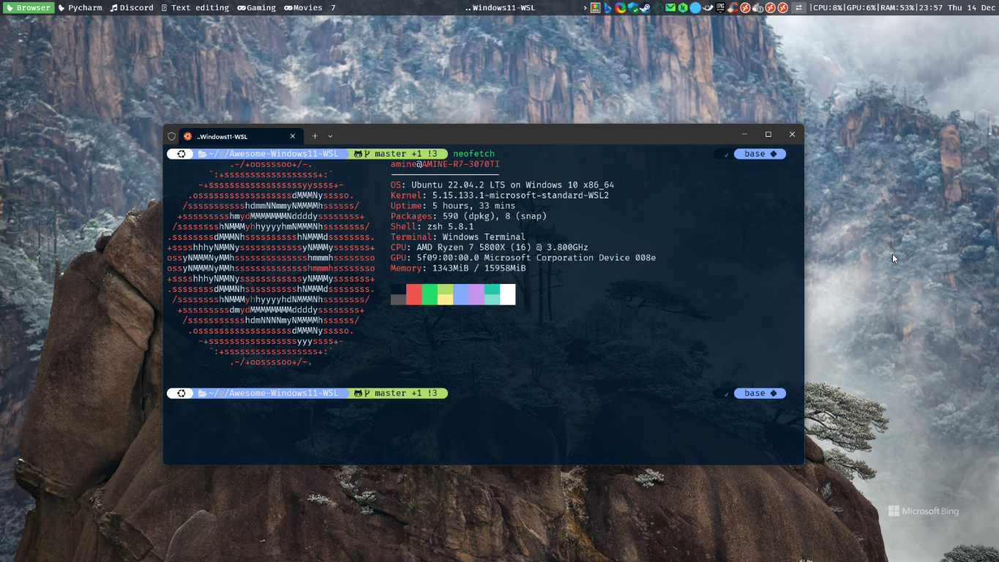

Linux / WSL2 (Ubuntu 22.04) Workflow
==================


A set of configurations, dotfiles and a script to automatically set up a powerful terminal & environment on Linux/WSL2 (Maybe will add an Ansible version of the bash script in the future).
For Windows/WSL users, you can check the parent [readme](../README.md)

**Table of Contents**
<!-- TOC -->
* [Linux / WSL2 (Ubuntu 22.04) Workflow](#linux--wsl2-ubuntu-2204-workflow)
  * [1. Setup Linux automatically](#1-setup-linux-automatically)
    * [1.1. Terminal customization](#11-terminal-customization)
    * [1.2. Run the script](#12-run-the-script)
<!-- TOC -->


## 1. Setup Linux automatically
I developed this tool to streamline the setup process when working on various servers, such as AWS instances and not having to install everything manually every time.
While it's particularly useful for Python developers, feel free to customize it for your specific needs. The script is in bash (might move to Ansible in the future).

### 1.1. Terminal customization
- Download and install the [Firacode font](https://github.com/ryanoasis/nerd-fonts/releases/download/v3.1.1/FiraCode.zip) on your primary operating system (Windows if you are using WSL).
- Configure your terminal to utilize the newly installed font. For Windows, check this [link](../windows_workflow/README.md#232-inswindows-terminalins). For Linux ##TODO.
### 1.2. Run the script
- Run this command & choose what to install: oh-my-zsh, pl10k theme,  miniconda & cuda (if you have a GPU) automatically:
```bash
sh -c "$(wget https://raw.githubusercontent.com/AmineDjeghri/Awesome-Windows11-WSL-Linux/master/unix_workflow/auto_linux_setup.sh -O -)"
```
- Do not run the script with `sudo` otherwise it will install some packages in `/root` instead of `/home`.
- Also, make sure to type `yes` when installing conda. If you are facing some problems, take a look at section 2.2.
- (Optional) If you have custom configurations in your `.bashrc`, consider copying them to the `.zshrc` file.
- (Optional) If you have ssh keys, copy them to the `.ssh` folder.


